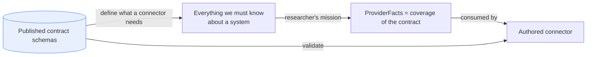
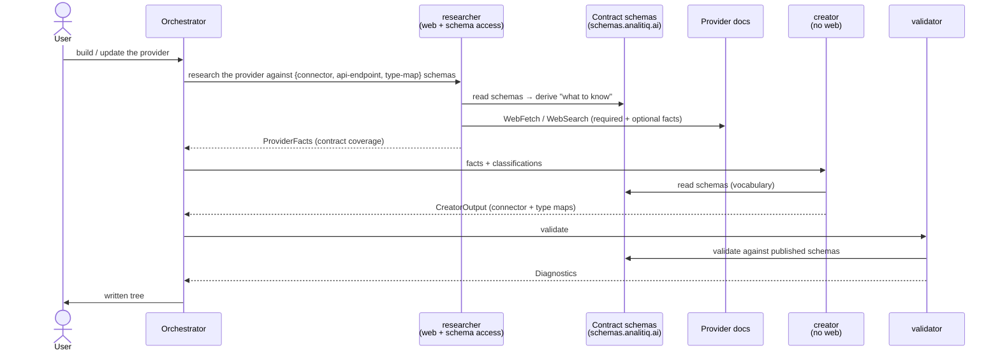
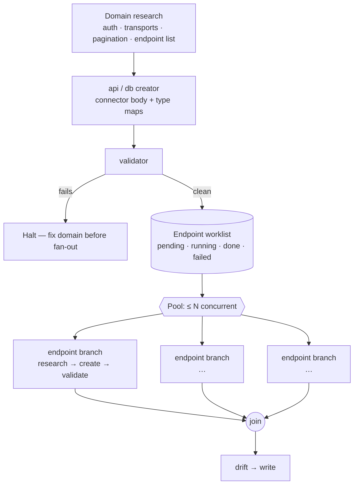
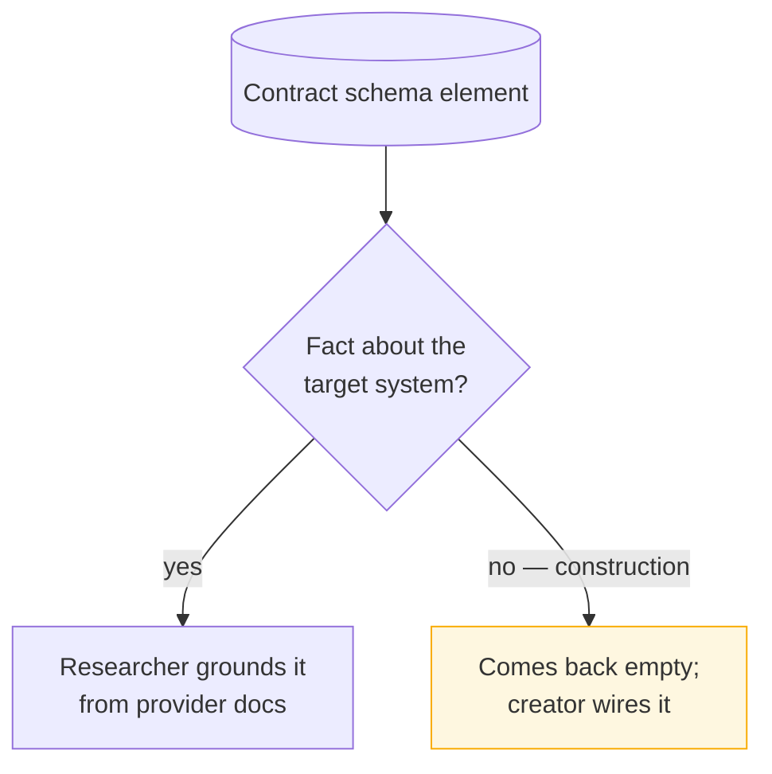
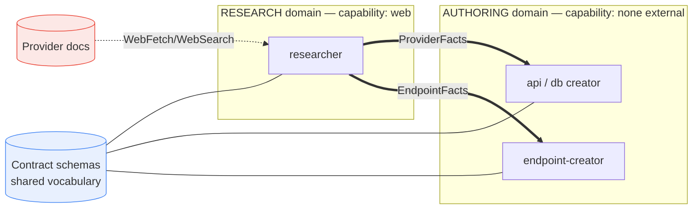
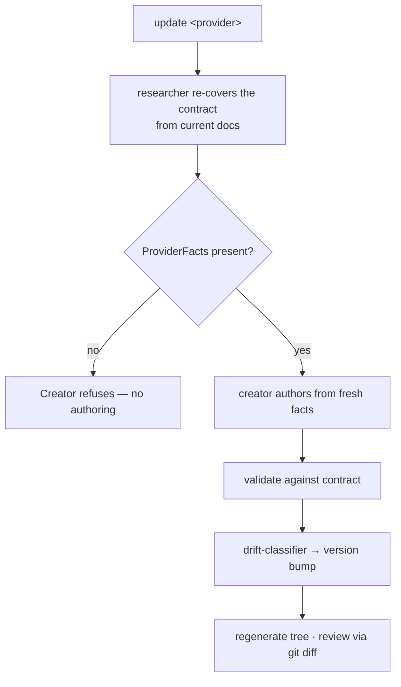

# Contract-Derived Research

**Status:** implemented · **Scope:** how `researcher`
decides what to research, and how `ProviderFacts` is defined.

> Implemented across the researcher (`agents/connector-provider-researcher.md`),
> the orchestrator (`skills/connector-builder/SKILL.md` + `references/pipeline.md`),
> the I/O contracts (`references/io-contracts.md`: `ProviderFacts` +
> `EndpointFacts`), the creators' hard gate, and the drift policy
> (`CLAUDE.md`, validator, `tests/connector_validator/test_schema_drift.py`).
> The agent-file rename to role-based names (§5) remains the one deferred
> item — this doc still uses the target names.

## TL;DR

Stop hand-maintaining `ProviderFacts` as a closed, connector-skeleton schema.
The **published contract schemas** (`connector`, `api-endpoint`,
`type-map-read`/`-write`) already define everything we must know about a
system to build a connector. So make them the researcher's mission spec:

> The researcher reads the live contract schemas and gathers **everything
> they ask about** the target system — all required fields, plus as much
> optional detail as the docs provide. `ProviderFacts` becomes the
> researcher's **coverage of the contract**, shaped like the contract — not
> a curated parallel list.

The agent boundary is unchanged: the researcher researches online, the
creator writes from facts. Both **read** the contract schemas as shared
*vocabulary*; neither gains the other's *capability*.

> **Priority: accuracy over cost.** This plugin is surgical and precise.
> Where precision trades off against cost or speed, choose precision —
> research deeper, validate more, and never coarsen facts to save work. Every
> design choice below is settled on accuracy first; cost is accepted, not
> optimized.

---

## 1. Why (the gap this closes)

Before this change, `ProviderFacts` (API branch) carried only the **connector
skeleton**: `auth_model · base_urls · post_auth_selections ·
discovery_endpoints · pagination · rate_limit`. `discovery_endpoints` held
`{purpose, method, path}` — **no response field schemas**. So field-level
provider truths (datetime zone-awareness, enum domains, nullability, formats)
had **no slot in research output** and were *guessed* by the authoring agents
instead of researched.

Consequences:

- **A ceiling on researchability.** Research emits only `ProviderFacts`
  (a closed schema). Anything not modelled there cannot leave research.
- **Authoring agents can't recover it.** Creators and `endpoint-creator`
  have `Read/Glob/Grep` only — no web access — so they cannot research the
  missing fact; they assert or guess it.
- **Updates can't fix field-level facts.** Re-running research returns the
  same skeleton; the re-author guesses again, re-introducing the bug.

Canonical example: an API `date-time` field guessed as tz-aware
`Timestamp(MICROSECOND, UTC)` when the provider (Wise) emits naive
`2016-12-13 22:57:03`. The deciding evidence — a sample wire value — has
nowhere to live, so it was never researched. (See issue #12.)

> The root cause is not "a missing datetime field." It is a missing
> **category** — researched per-resource field schemas — caused by
> `ProviderFacts` being a *hand-curated subset* of what the contract needs.

---

## 2. Principle

The contract is the single source of truth for *what to know*. `ProviderFacts`
is derived from it (a coverage view), not maintained alongside it — which
also ends the `io-contracts.md` drift problem.

**Drift policy.** The same rule governs the **whole plugin**, not just
`ProviderFacts`:

> The published schema is the single source of truth. **Never restate what
> it defines — reference or load it.** Carry only craft the schema can't
> express (judgment, idioms, gotchas, workflow).

This splits everything into **contract** (don't duplicate — field shapes,
enums, vocabularies, `$schema` URLs) and **craft** (keep — *how* to choose,
the "why", provider gotchas). Three mechanisms:

- **`$ref`** the live schema for any JSON-schema shape the plugin needs.
- **Fetch-once, pass-down** — the orchestrator/researcher fetches the live
  schemas per run (cached, as the validator already does) and passes them
  into sub-agent context, so the creators read the *same* schema the
  validator enforces.
- **Drift-check CI** for anything that must stay duplicated (e.g.
  enum-mapper logic, which has to change with the enum anyway): load the live
  schemas and fail the build on divergence.

Accuracy rises — the live schema is always current and is exactly what the
validator enforces — and the cost is one cached fetch per run. Craft is not
drift-exposed because the schema never defined it.

---

## 3. Mechanism — researcher reads the contract schema

### 3.1 The branch (unit of work)

- The **orchestrator** hands the researcher the live schema URLs.
- The **researcher** walks them to know *what* to find, then researches the
  provider for all required + as much optional info as the docs support, and
  returns a contract-shaped coverage object.
- The **creator** reads the same schemas as vocabulary and authors from the
  facts. It never reads docs; the researcher never authors.

Optional determinism aid: the orchestrator may pre-derive an explicit
checklist by walking the schema and pass it to the researcher. **The
schema-walk lives in the orchestrator, never the creator** — a creator
planning research would blur its one job (write from facts).

### 3.2 Fan-out — domain first, then endpoints in parallel

One branch is the unit of work. For an API with many endpoints the
orchestrator runs branches **concurrently**, with a **barrier** between two
stages:

1. **Domain branch first — and it must validate clean.** Research the
   connector-level facts (auth, transports, pagination, rate limits, base
   URLs) and the *endpoint list* → `api-creator` / `db-creator` authors the
   connector body + type maps → `validator`. Endpoints reference the
   connector's transports/auth, so the domain must be authored and clean
   **before** any endpoint branch starts.
2. **Enumerate endpoints into a worklist.** From the domain research's
   resource list, record every endpoint as a TODO item with a state
   (`pending → running → done · failed`). This is how the orchestrator tracks
   the fan-out without dropping endpoints.
3. **Endpoint branches in parallel, bounded.** Each endpoint is its own
   `researcher → endpoint-creator → validator` branch — research that
   endpoint's response schema (field types incl. datetime zone-awareness),
   author the endpoint document, validate it. Run at most **N branches
   concurrently** (default **10**); as one finishes, pull the next `pending`
   item.
4. **Join, then finish.** When the worklist is drained, proceed to drift +
   write.

- **Database connectors don't fan out** — they author no endpoint files
  (resources are connection-scoped, discovered at runtime), so the domain
  branch is the whole job.
- **No write conflicts:** each endpoint branch authors a *different* file;
  the domain `connector.json` is read-only to them (transport refs).
- **Failure is isolated:** an endpoint branch that can't pass validation is
  marked `failed` in the worklist and surfaced — it doesn't block siblings,
  and the orchestrator reports partial results rather than silently dropping
  the endpoint.
- **Per-endpoint research is the *precise* choice, not a cost trick.** Each
  endpoint gets a dedicated pass focused on its own docs, so its field schema
  (datetime zone-awareness, enums, nullability) is grounded on evidence
  rather than a thin slice of one sprawling pass. The bounded parallelism is
  a side benefit; it never justifies coarsening research (the
  accuracy-over-cost priority applied — see the note up top).
- **Type vocabulary stays connector-level.** The domain branch researches the
  connector-wide native-type vocabulary so `type-map-read` is authored
  complete *before* fan-out; each endpoint's fields must resolve through that
  map. A genuinely new native surfaced by an endpoint is a *domain-level*
  type-map addition (re-validate the domain), never an endpoint-local one —
  this keeps canonical types consistent across endpoints.

---

## 4. System facts vs authoring wiring (the self-sorting boundary)

A connector schema mixes two kinds of fields. "Research everything" means
*ground every element that is a fact about the system*; the wiring fields
have no doc-findable answer and come back empty **by design**, and the
author fills them. No per-field tagging is needed — it self-sorts.

| Schema element | Kind | Who supplies it |
|---|---|---|
| Auth family / scopes / refresh | system fact | researcher |
| Base URLs / origins | system fact | researcher |
| Pagination style + params | system fact | researcher |
| Rate limits | system fact | researcher |
| Per-resource response field types | system fact | researcher |
| **Datetime zone-awareness (sample value)** | system fact | researcher |
| Enum domains / nullability / formats | system fact | researcher |
| `value-expression` refs / templates | authoring wiring | creator |
| DSN binding `encoding` | authoring wiring | creator |
| `transport_ref` plumbing | authoring wiring | creator |

---

## 5. Capabilities, ownership, boundaries

> **Naming.** Agents use role-based names — the redundant `connector-`
> prefix is dropped (the plugin already says *connector-builder*):
> `researcher`, `validator`, `drift-classifier`, `api-creator`,
> `db-creator`, `storage-creator`, `endpoint-creator`. The orchestrator
> skill stays `connector-builder`. The repo-wide rename of the agent files
> is a separate refactor; this doc uses the target names.

### 5.1 Capability matrix

| Agent | Read docs (web) | Read contract schemas | Author connector JSON | Validate |
|---|:---:|:---:|:---:|:---:|
| `researcher` | ✅ | ✅ (as spec) | ❌ | ❌ |
| `api-creator` / `db-creator` | ❌ | ✅ (as vocabulary) | ✅ | ❌ |
| `endpoint-creator` | ❌ | ✅ (as vocabulary) | ✅ (endpoints) | ❌ |
| `validator` | ❌ | ✅ (to validate) | ❌ | ✅ |
| `orchestrator` | ❌ | ✅ (to derive checklist) | ❌ (dispatches) | ❌ |

The contract schema is **read** by everyone — shared *vocabulary*. Web access
is **only** the researcher's — the *capability* that defines the boundary.

### 5.2 Ownership

| Artifact | Owner |
|---|---|
| What-to-research (mission spec) | contract schemas (derived) |
| `ProviderFacts` (contract coverage) | `researcher` |
| Connector body + type maps | `api-creator` / `db-creator` |
| Endpoint documents | `endpoint-creator` |
| Pass/fail against the contract | `validator` |
| Phase sequencing + dispatch | orchestrator |
| Endpoint fan-out: worklist + concurrency cap | orchestrator |

### 5.3 Boundary

**The wall:** facts flow one way (research → authoring). Provider docs touch
**only** the research domain. The contract schema is the one thing both sides
share, and it is read-only vocabulary, not a capability.

---

## 6. Update flow + the hard gate

In `update` mode the same pipeline runs; the creator's **hard gate** makes
skipping research structurally impossible — there is no `CreatorOutput`
without `ProviderFacts` from this run's research.

Because the research scope is now *derived from the contract*, a field-level
correction (e.g. datetime zone-awareness) is part of what research must
cover — it can no longer fall through to a guess.
