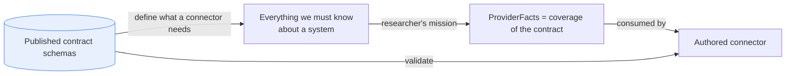
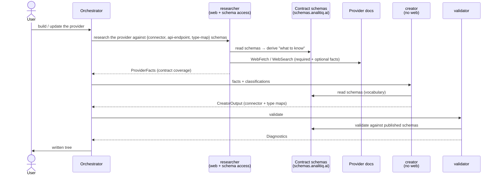
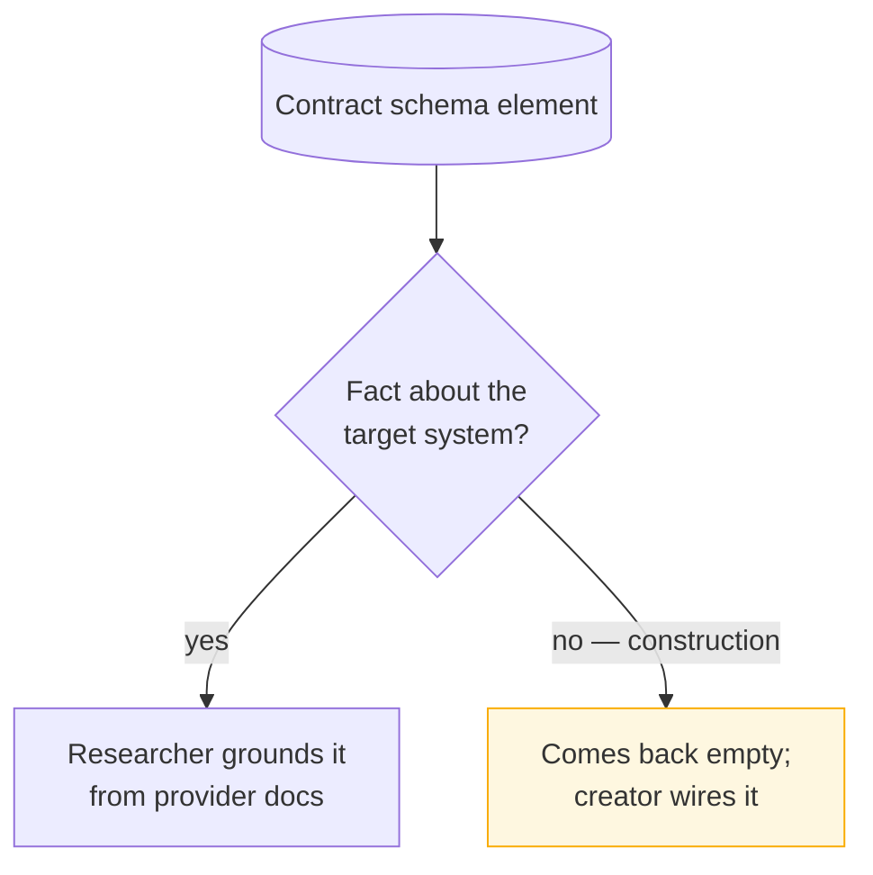
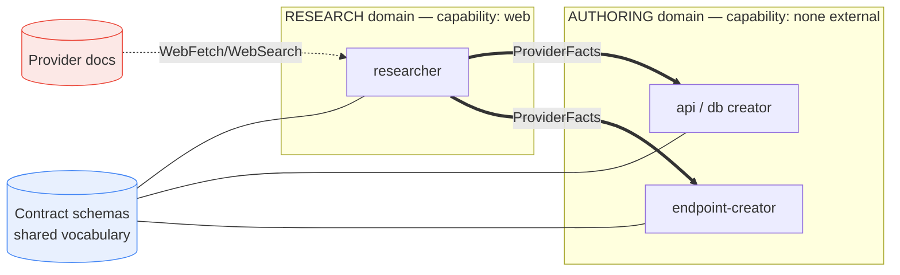

# Contract-Derived Research

**Status:** design proposal · **Scope:** how `researcher`
decides what to research, and how `ProviderFacts` is defined.

## TL;DR

Stop hand-maintaining `ProviderFacts` as a closed, connector-skeleton schema.
The **published contract schemas** (`connector`, `api-endpoint`,
`type-map-read`/`-write`) already define everything we must know about a
system to build a connector. So make them the researcher's mission spec:

> The researcher reads the live contract schemas and gathers **everything
> they ask about** the target system — all required fields, plus as much
> optional detail as the docs provide. `ProviderFacts` becomes the
> researcher's **coverage of the contract**, shaped like the contract — not
> a curated parallel list.

The agent boundary is unchanged: the researcher researches online, the
creator writes from facts. Both **read** the contract schemas as shared
*vocabulary*; neither gains the other's *capability*.

---

## 1. Why (the gap this closes)

`ProviderFacts` (API branch) today carries only the **connector skeleton**:
`auth_model · base_urls · post_auth_selections · discovery_endpoints ·
pagination · rate_limit`. `discovery_endpoints` holds `{purpose, method,
path}` — **no response field schemas**. So field-level provider truths
(datetime zone-awareness, enum domains, nullability, formats) have **no slot
in research output** and are *guessed* by the authoring agents instead of
researched.

Consequences:

- **A ceiling on researchability.** Research emits only `ProviderFacts`
  (a closed schema). Anything not modelled there cannot leave research.
- **Authoring agents can't recover it.** Creators and `endpoint-creator`
  have `Read/Glob/Grep` only — no web access — so they cannot research the
  missing fact; they assert or guess it.
- **Updates can't fix field-level facts.** Re-running research returns the
  same skeleton; the re-author guesses again, re-introducing the bug.

Canonical example: an API `date-time` field guessed as tz-aware
`Timestamp(MICROSECOND, UTC)` when the provider (Wise) emits naive
`2016-12-13 22:57:03`. The deciding evidence — a sample wire value — has
nowhere to live, so it was never researched. (See issue #12.)

> The root cause is not "a missing datetime field." It is a missing
> **category** — researched per-resource field schemas — caused by
> `ProviderFacts` being a *hand-curated subset* of what the contract needs.

---

## 2. Principle

The contract is the single source of truth for *what to know*. `ProviderFacts`
is derived from it (a coverage view), not maintained alongside it — which
also ends the `io-contracts.md` drift problem.

---

## 3. Mechanism — researcher reads the contract schema

Chosen approach (of the three considered, see §7):

- The **orchestrator** hands the researcher the live schema URLs.
- The **researcher** walks them to know *what* to find, then researches the
  provider for all required + as much optional info as the docs support, and
  returns a contract-shaped coverage object.
- The **creator** reads the same schemas as vocabulary and authors from the
  facts. It never reads docs; the researcher never authors.

Optional determinism aid: the orchestrator may pre-derive an explicit
checklist by walking the schema and pass it to the researcher. **The
schema-walk lives in the orchestrator, never the creator** — a creator
planning research would blur its one job (write from facts).

---

## 4. System facts vs authoring wiring (the self-sorting boundary)

A connector schema mixes two kinds of fields. "Research everything" means
*ground every element that is a fact about the system*; the wiring fields
have no doc-findable answer and come back empty **by design**, and the
author fills them. No per-field tagging is needed — it self-sorts.

| Schema element | Kind | Who supplies it |
|---|---|---|
| Auth family / scopes / refresh | system fact | researcher |
| Base URLs / origins | system fact | researcher |
| Pagination style + params | system fact | researcher |
| Rate limits | system fact | researcher |
| Per-resource response field types | system fact | researcher |
| **Datetime zone-awareness (sample value)** | system fact | researcher |
| Enum domains / nullability / formats | system fact | researcher |
| `value-expression` refs / templates | authoring wiring | creator |
| DSN binding `encoding` | authoring wiring | creator |
| `transport_ref` plumbing | authoring wiring | creator |

---

## 5. Capabilities, ownership, boundaries

> **Naming.** Agents use role-based names — the redundant `connector-`
> prefix is dropped (the plugin already says *connector-builder*):
> `researcher`, `validator`, `drift-classifier`, `api-creator`,
> `db-creator`, `storage-creator`, `endpoint-creator`. The orchestrator
> skill stays `connector-builder`. The repo-wide rename of the agent files
> is a separate refactor; this doc uses the target names.

### 5.1 Capability matrix

| Agent | Read docs (web) | Read contract schemas | Author connector JSON | Validate |
|---|:---:|:---:|:---:|:---:|
| `researcher` | ✅ | ✅ (as spec) | ❌ | ❌ |
| `api-creator` / `db-creator` | ❌ | ✅ (as vocabulary) | ✅ | ❌ |
| `endpoint-creator` | ❌ | ✅ (as vocabulary) | ✅ (endpoints) | ❌ |
| `validator` | ❌ | ✅ (to validate) | ❌ | ✅ |
| `orchestrator` | ❌ | ✅ (to derive checklist) | ❌ (dispatches) | ❌ |

The contract schema is **read** by everyone — shared *vocabulary*. Web access
is **only** the researcher's — the *capability* that defines the boundary.

### 5.2 Ownership

| Artifact | Owner |
|---|---|
| What-to-research (mission spec) | contract schemas (derived) |
| `ProviderFacts` (contract coverage) | `researcher` |
| Connector body + type maps | `api-creator` / `db-creator` |
| Endpoint documents | `endpoint-creator` |
| Pass/fail against the contract | `validator` |
| Phase sequencing + dispatch | orchestrator |

### 5.3 Boundary

**The wall:** facts flow one way (research → authoring). Provider docs touch
**only** the research domain. The contract schema is the one thing both sides
share, and it is read-only vocabulary, not a capability.

---

## 6. Update flow + the hard gate

In `update` mode the same pipeline runs; the creator's **hard gate** makes
skipping research structurally impossible — there is no `CreatorOutput`
without `ProviderFacts` from this run's research.

Because the research scope is now *derived from the contract*, a field-level
correction (e.g. datetime zone-awareness) is part of what research must
cover — it can no longer fall through to a guess.

---

## 7. Alternatives considered

| Option | What | Verdict |
|---|---|---|
| **3 — researcher reads the schema** | Researcher derives its own mission from the live contract | **Chosen.** Cleanest fit for the research/author boundary; no per-field decisions |
| 2 — orchestrator builds a checklist | Orchestrator walks the schema → checklist → researcher fills it | Fine as a determinism aid **inside the orchestrator** only |
| 1 — creator requests facts piece by piece | Authoring agent drives research interactively | **Rejected** — makes the author drive research, reintroducing the coupling we want gone |
| 0 — per-field `x-source` tags | Tag each schema field provider/author | **Rejected** — manual, unscalable; everything researchable should be researched |

---

## 8. Cost (real, and intentional)

Deriving the research scope from the **endpoint** contract means the
researcher must now produce **per-resource field schemas** — including the
evidence (a sample wire value) that decides datetime zone-awareness, plus
enum domains, nullability, and formats. That is more research work than
today's skeleton-only pass.

This cost is **unavoidable under contract-derivation, and that is the
point**: it is the price of field-level facts being *researched instead of
guessed*. It falls out of the contract automatically rather than being an
opt-in extra.

---

## 9. Concrete changes (when implemented)

1. **`io-contracts.md`** — `ProviderFacts` stops hand-curating field shapes;
   it becomes a contract-coverage object (mirrors / `$ref`s the live
   `connector`, `api-endpoint`, `type-map-read` schemas).
2. **`researcher`** — granted read access to the contract
   schemas; mission reframed to "cover the contract for this system."
3. **Orchestrator** — optionally derive + pass a checklist (schema-walk stays
   here).
4. **Creators** — keep the existing `ProviderFacts` hard gate; "facts" now
   includes per-resource field schemas.

> Not implemented by this document — this is the design of record for the
> change.
